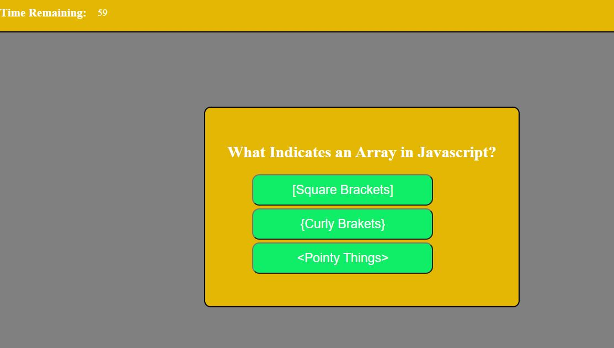

# Javascript Quiz

## Description
This is a five question quiz with simple questions about Javascript.  A timer with 60 seconds begins ticking down when a user starts the quiz.  When a user selects the correct answer, the quiz advances to the next question.  If the answer is incorrect, 10 seconds is deducted from the timer and the quiz advances to the next question.  When the timer hits 0, either from wrong answers or time reaching 0, the quiz ends.  The user is prompted to enter their initials.  Initials are entered in local storage and previous scores are displayed.

### Features
* Five questions
* A timer that begins with the user hits a button
* Time is docked with a question is answered wrong
* The next question is show when a question is answered
* The user can enter initials at the end of the quiz
* The user's score is saved to local storage

## Screenshot

## Tools
The quiz is created in Javascript with HTML and CSS

### Deployed URL
[Javascript Quiz](https://aneslin.github.io/javascript-quiz)

### Acknowledgements
I learned about the Object.entries() method from 
[Atta](https://attacomsian.com/blog/javascript-iterate-objects)